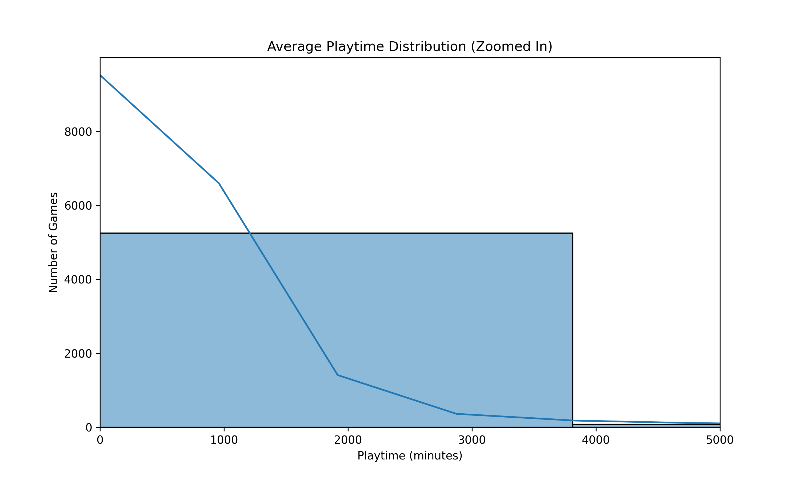
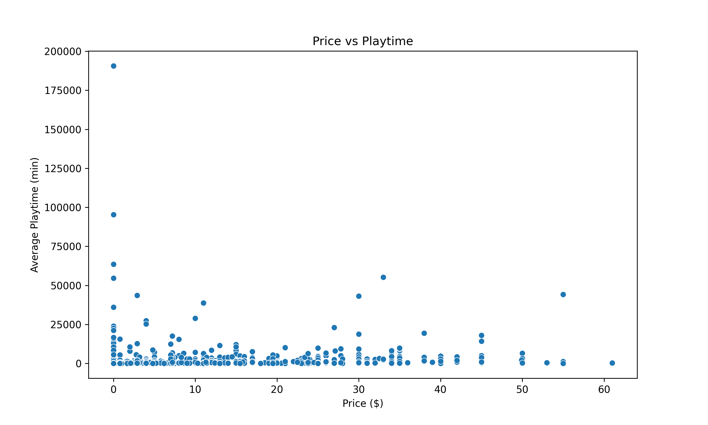
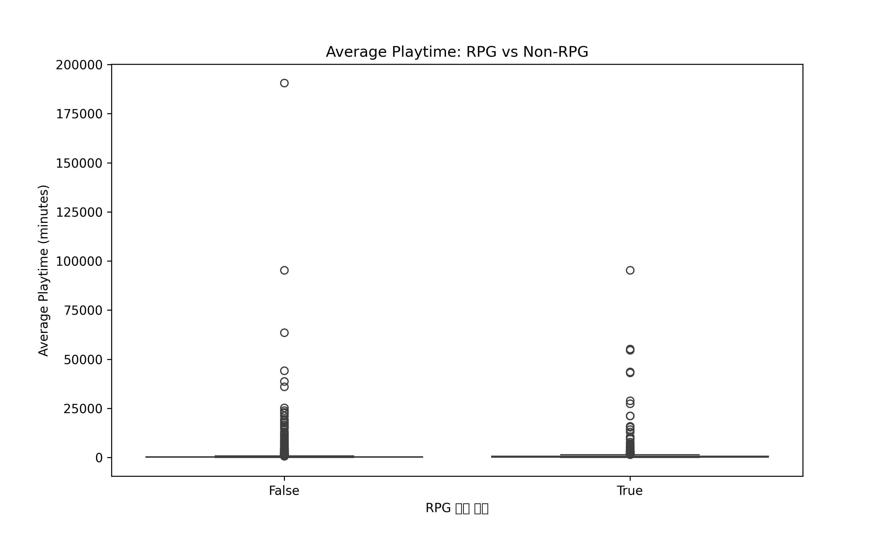
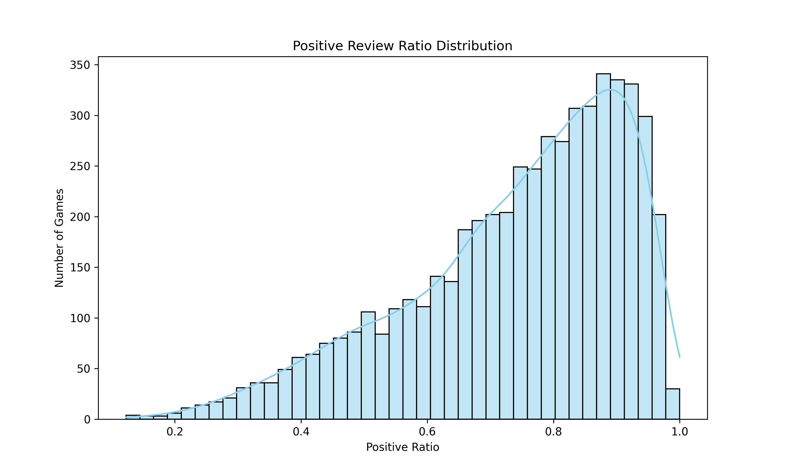
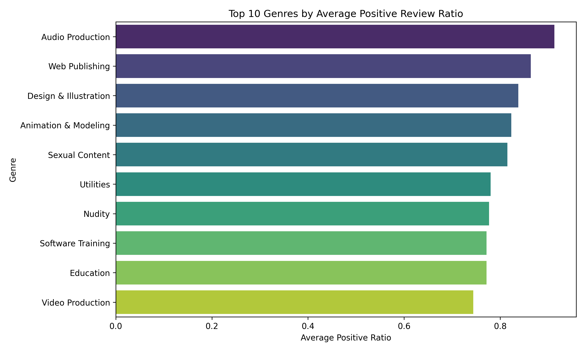

# 🎮 steam-review-analysis
게임 리뷰 데이터를 분석하여 유저 행동과 감정 흐름을 시각화하고,  
플레이타임과 추천 여부의 관계, 장르별 리뷰 패턴을 파악합니다.

## 📌 Goal
- 유저들의 리뷰 감성(긍/부정) 분석
- 플레이타임과 추천률의 상관관계 도출
- 장르별로 리뷰 패턴 비교
- 시각화 대시보드 제작

## 📂 프로젝트 구조

| 폴더명 | 설명 |
|--------|------|
| `data/` | 분석에 사용된 원본 및 전처리 데이터 |
| `notebooks/` | EDA 및 감성분석, 시각화 노트북 |
| `visuals/` | 결과로 생성된 차트 및 이미지 |
| `report/` | 분석 결과 요약 및 인사이트 정리 |
| `requirements.txt` | 필요한 패키지 리스트 |

## 🔧 사용 기술
- Pandas, Seaborn, plotly, Jupyter Notebook
- Git
- Notion

## 📈 주요 분석 항목
- 장르별 유저들의 만족도 분석(긍정적 평가의 빈도)

## 결론
- 대부분의 게임은 평균 1,000분 이하의 플레이타임을 가짐

- 일부 대형 게임은 10만분 이상으로 튀는 그래프를 보여줌

- 평균적으로 rpg가 non-rpg보다 플레이타임 시간이 김

- 긍정률은 대부분 70% 이상을 가져가고 있음

- 창작 도구 계열(Audio, Design 등)은 긍정률이 매우 높음 → 만족도 높음

## 확장 가능성
- 리뷰 텍스트 기반 분석을 할수도 있을 것 같음

## 레포트
1. [전처리 레포트](reports/01_summary.md)
2. [eda 레포트](reports/02_eda_summary.md)
3. [장르 분석 레포트](reports/03_genre_analysis.md)