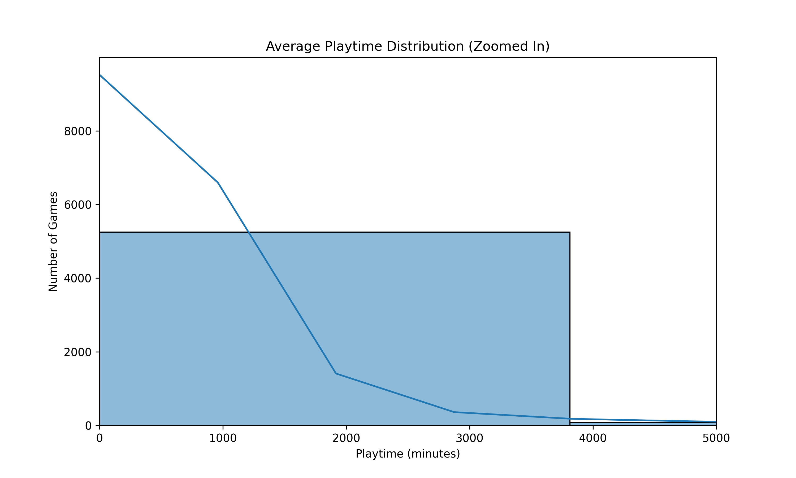
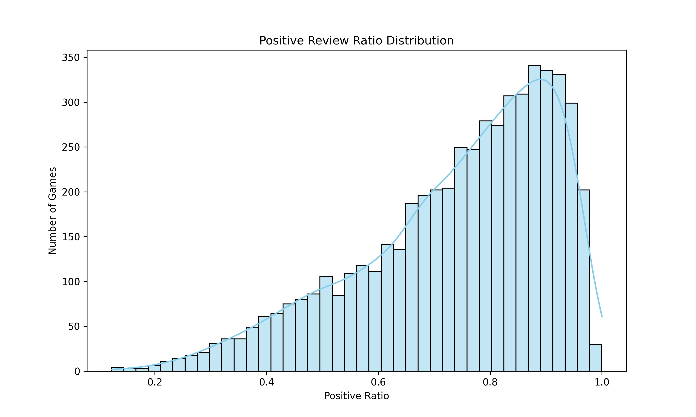

# Step 2 : EDA 리포트

## EDA란?
`Exploratory Data Analysis (탐색적 데이터 분석)`은 데이터 분석 전 `데이터 구조와 특성`을 파악하고 `숨어 있는 패턴, 이상치, 분포, 상관관계 등을 탐색`하는 과정이다.

## 주요 분석 지표 및 시각화 요약

### 1. 평균 플레이타임 분포

대부분의 게임은 평균 5,000분 이하의 플레이타임을 기록하고 있으며,  
일부 대형 게임은 10만 분 이상으로 극단적인 값을 가진다.  
우측으로 치우친 분포를 확인할 수 있다.

---

### 2. 긍정 vs 부정 리뷰 수 분포

대부분의 게임이 리뷰 수가 1,000개 미만이며,  
긍정 리뷰가 전반적으로 압도적으로 많은 경향을 보인다.  
이는 Steam 플랫폼 특성과도 관련이 있다고 보인다.

---

### 3. 긍정률(Positive Ratio) 분포

긍정률은 `positive_ratings / (positive_ratings + negative_ratings)`로 계산되며,  
0.7 ~ 0.95 사이에 대부분의 게임이 분포한다.  
즉, 많은 게임이 긍정적인 평가를 받고 있음을 의미한다.

---

### 4. RPG 포함 여부에 따른 평균 플레이타임

`genres` 컬럼을 기준으로 RPG 포함 여부를 구분하여  
RPG와 비-RPG 게임의 평균 플레이타임을 비교하였다.  
RPG 게임이 비-RPG보다 확실히 평균적으로 더 긴 플레이타임을 가지는 경향을 보였다.

|  구분 | count | mean | median | max  |
|------|-------|-------|--------|-------|
|Non-RPG|  4321|   618.21|   221.0|  190625|
|RPG   |    1073|  1075.28|   280.0|   95245|

